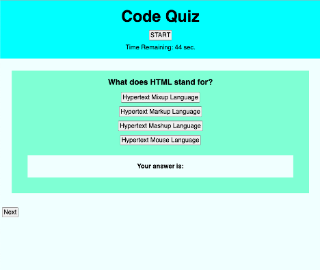

# Caitlin Stevenson|Code Quiz Assignment

## Objectives

In this project, I created a five question coding quiz in which the user selects the start button to initiate the first question and navigates through by answering questions and selecting the "next" button on the page. Each prompt presents a new question and corresponding set of answers. If the user selects the correct answer they will be rewarded with 5 points towards their high score and an additional 5 seconds added to their time, however if the user gets the question wrong they will have 2 seconds deducted from their total time. The quiz concludes when the timer runs down to 0 or the user answers all 5 quiz questions. At this time the user will have the opportunity to log their high score and "try again".

## Screenshot of Final Page

## Link To The Final Page

[Link to final webpage](https://caitlinscodes.github.io/code_quiz/)

## License

This code is licensed under the MIT License.